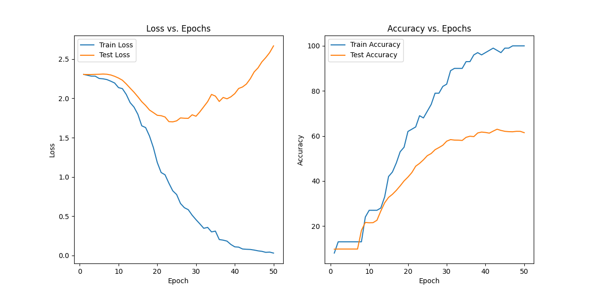

# NN-Convolution-Autoencoder
This project implements a deep learning pipeline using PyTorch for the **MNIST** dataset, focusing on both autoencoder-based feature extraction and classification tasks. The pipeline includes the following components:

* Encoder: Convolutional neural network (CNN) that compresses input images into a lower-dimensional latent space.
* Decoder: CNN that reconstructs images from the latent space representation.
* Autoencoder: Combination of the Encoder and Decoder for unsupervised learning to reconstruct input images.
* Classifier: CNN that uses the pre-trained Encoder for feature extraction and a multi-layer perceptron (MLP) for digit classification.
* ClassifierDecoding: Network combining a pre-trained encoder and a decoder for fine-tuning with a reconstruction-based approach.
## Key Features
* **Autoencoder**: Trained to minimize reconstruction loss, demonstrating effective compression and reconstruction of MNIST digits.
* **Classifier**: Trained to predict digit classes using cross-entropy loss, incorporating transfer learning for improved performance with limited labeled data.
* **Fine-tuning**: Demonstrates the use of pre-trained encoders for improved classification accuracy with a small labeled dataset.
* **Visualization**: Plots training and test losses, accuracies, and reconstructed images to evaluate model performance.

## Results
* The **Autoencoder** achieves high reconstruction accuracy, as demonstrated by the plotted some original images and the reconsructed images:
  
* The training and test errors and accuracies of the **Classifier** over 10 epochs:
  
* Useing small set to train the classifier network (only 100 sample), we can obtain that the classifier achieves low scores:
  
  Then, when fine-tuned with a pre-trained encoder, the **Classifier** shows improved performance, even with a limited labeled dataset:
  
## Contributing
Contributions are welcome! Please open an issue or submit a pull request for any features, bug fixes, or improvements.

## License
This project is licensed under the MIT License. See the LICENSE file for details.
